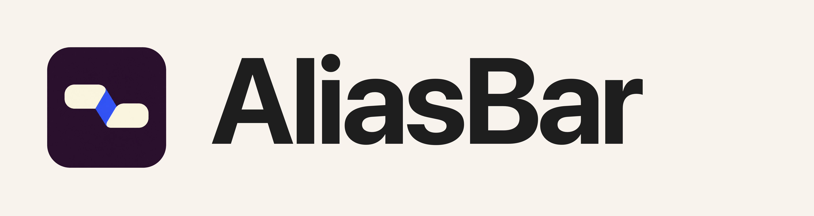
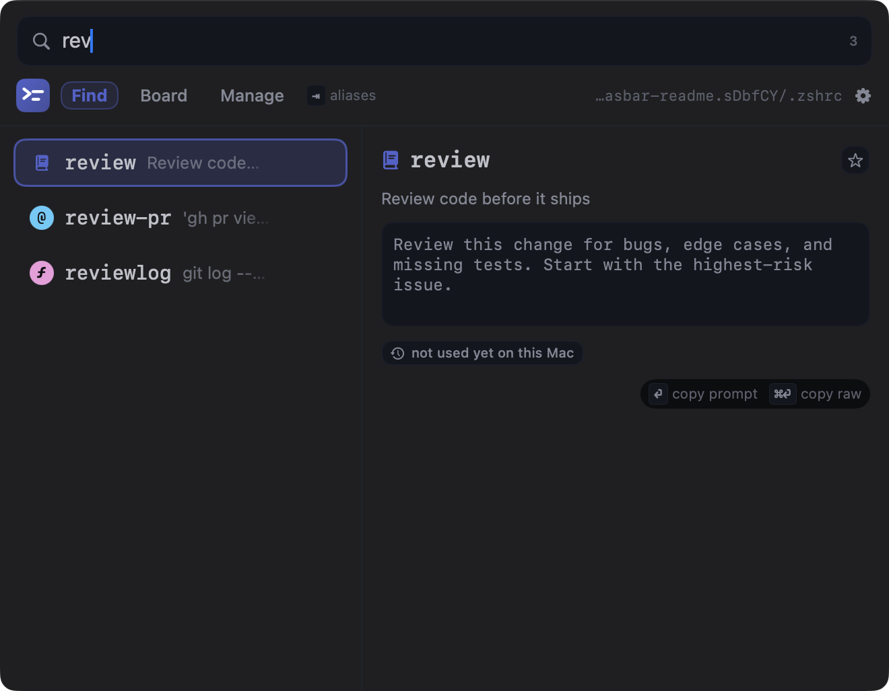
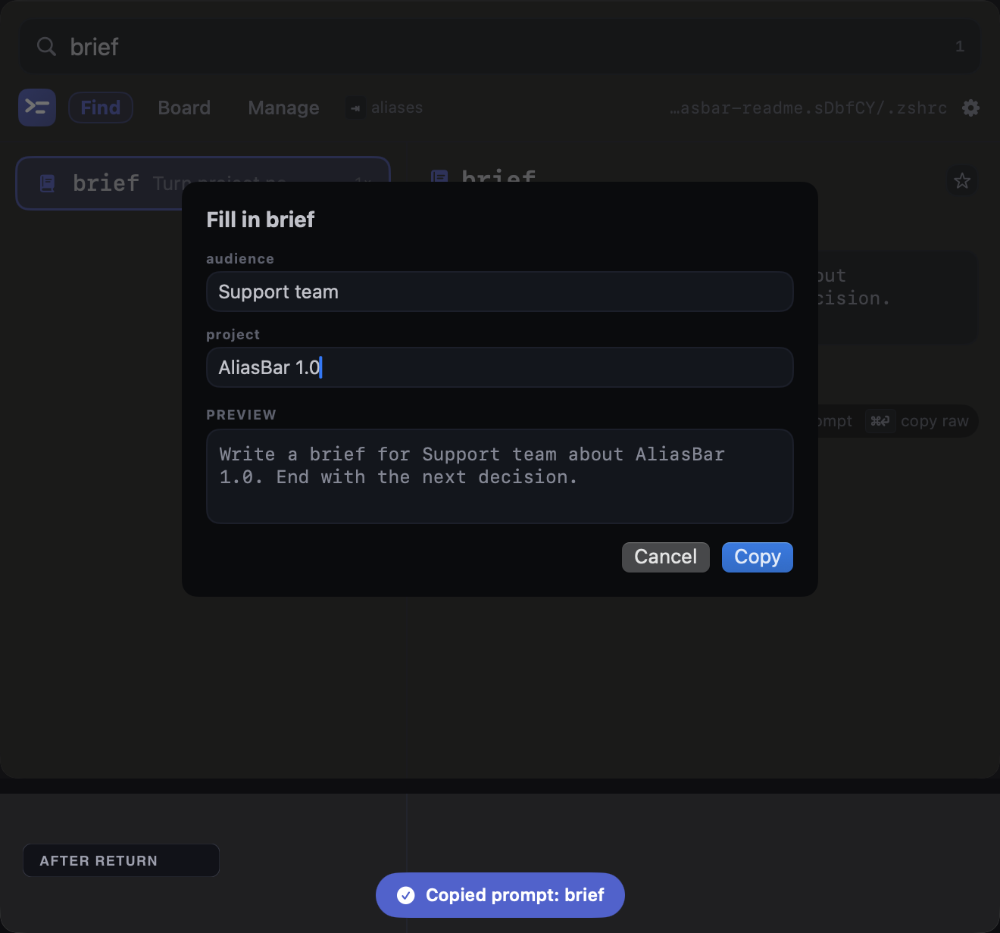
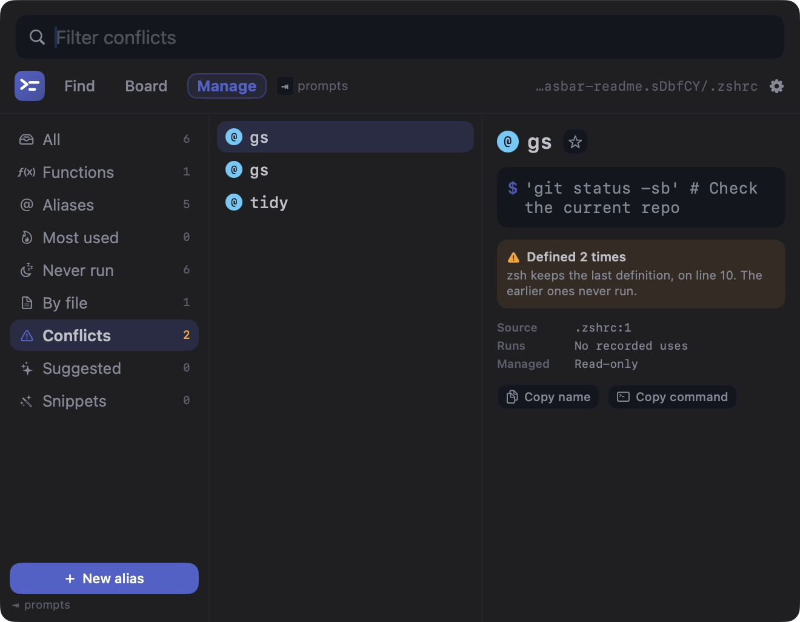
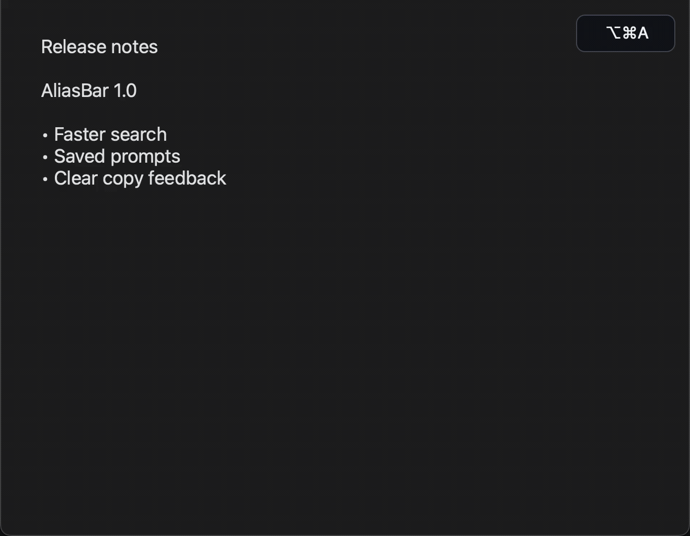
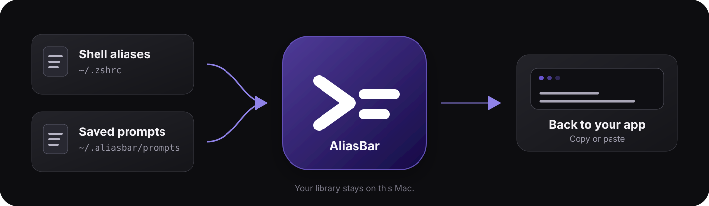

**Your aliases and prompts, ready in any app.**

Press `⌥⌘A`, type a few letters, and press Return. AliasBar copies or pastes the selected text.



## Aliases and prompts

| Aliases | Prompts |
|---|---|
| Find shell aliases and functions. | Save prompts for ChatGPT, Claude, and other apps. |
| See commands, usage, and conflicts. | Add `{{slots}}` for details that change. |
| Create and edit aliases without changing the rest of your shell file. | Use a prompt as a Claude Code `/command`. |

AliasBar reads aliases from `~/.zshrc` and prompts from `~/.aliasbar/prompts/`.

### Fill in the details

AliasBar asks for each `{{slot}}`, then shows the text it will copy or paste.



### Fix alias conflicts

Manage shows duplicate aliases, which definition wins, and where to fix it.



## Keys

| Key | Action |
|---|---|
| `⌥⌘A` | Open AliasBar |
| type | Search |
| `↑` `↓` | Move |
| `⏎` | Use the selected item |
| `⇥` | Switch between prompts and aliases |
| `⌘1` `⌘2` `⌘3` | Find, Board, Manage |
| `⌘P` | Pin or unpin an alias or prompt |
| `esc` | Close |

[](docs/shortcut.mp4)

## Your files stay on your Mac



- Clipboard monitoring and text expansion start off.
- Pasting into another app requires Accessibility. Copying does not.
- AliasBar backs up your shell config before changing its own block.
- The only network access is an optional update check.

## Install

Requires macOS 13+ and Xcode Command Line Tools.

```sh
git clone https://github.com/localtoasted/aliasbar.git
cd aliasbar
./build.sh --install
open ~/Applications/AliasBar.app
```

Use another shell config with:

```sh
ALIASBAR_ZSHRC=~/.config/zsh/.zshrc open ~/Applications/AliasBar.app
```

## Command line

The build includes `.build/ab`:

```sh
.build/ab list
.build/ab search git
.build/ab add gs 'git status -sb'
```

Install the CLI with `brew install localtoasted/aliasbar/aliasbar`.

## Build and test

```sh
./build.sh
./test.sh
```

Built with SwiftUI. MIT licensed.
