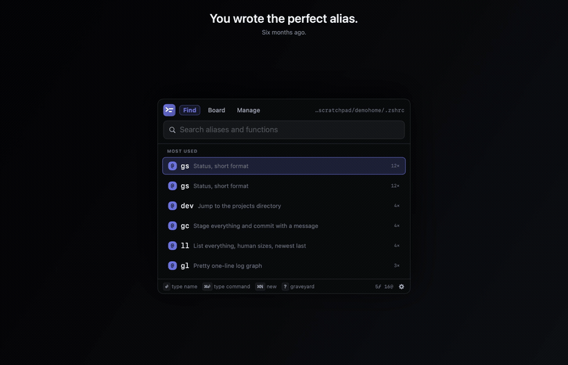
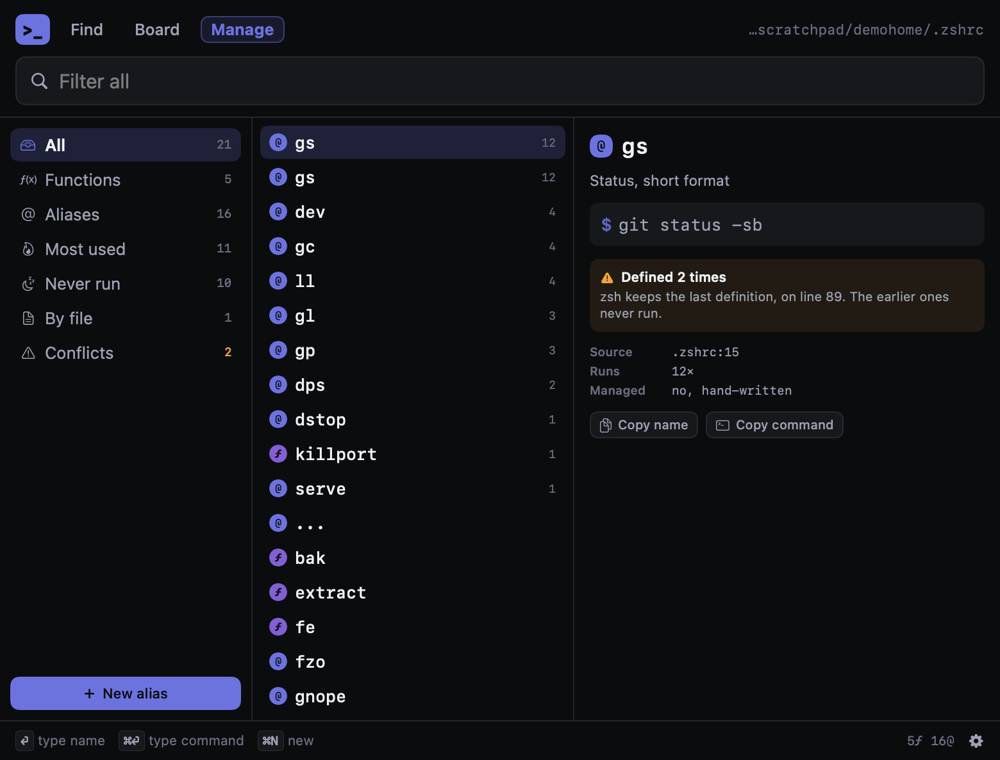

# AliasBar `>_`

**Every alias and shell function you've ever written, one keystroke away.**

You wrote the perfect alias six months ago. Now you're grepping `.zshrc` trying to remember what you called it.

That's the actual problem: an alias is a compression artifact, and the key to retrieving it is your memory of having made it. Compression outpaces recall. AliasBar hits `⌥⌘A`, you type two letters, and the name lands in your terminal.



## Three views, no more

**Find** — the default, and the one you'll live in. Search field already focused, results ranked exact name → prefix → substring → comment → command, with how often you've actually run each one breaking ties. Capped at six on purpose: past that you're reading a list, and reading is slower than typing one more character.

**Board** — every alias at once as a keycap grid. Names are two to four characters, so a list shows eight where a grid shows fifty. Typing *dims* non-matches instead of removing them, so the grid never reflows and you can learn where things live.

**Manage** — sidebar, list, detail. Buckets for functions, aliases, most used, **never run**, by file, and **conflicts**. This is where you find out that alias you wrote in 2023 has never once been executed.



## What it tells you that you didn't know

- **The graveyard** — everything you've defined and never actually run, from your real shell history.
- **Conflicts** — the same name defined twice (zsh keeps the last one, the earlier ones are dead code), an alias shadowing a real binary on your `PATH` (*"why is `ls` weird on this machine?"*), or an alias and a function fighting over a name (the alias always wins).

## Completely mouseless

| | |
|---|---|
| `⌥⌘A` | open from anywhere |
| type | filter |
| `↑` `↓` or `⌃n` `⌃p` | move |
| `⏎` | primary action |
| `⌘⏎` | the other one |
| `⌘1` `⌘2` `⌘3` | Find / Board / Manage |
| `⇥` | flip Find/Board between shell and prompts, or cycle Manage's sidebar |
| `⌘K` | clipboard, as a Find source |
| `?` `!` `@` `#` | jump straight to graveyard / conflicts / by file / stats |
| `⌘N` `⌘E` | new alias or prompt, edit the selected one |
| `⌘I` `⌥⌘I` | copy an audit prompt for ChatGPT/Claude (web / local-agent ending) |
| `⌘,` | settings |
| `esc` | dismiss **and hand focus back to the app you came from** |

**No permission prompts for any of that.** The global hotkey uses the system hotkey API, so AliasBar is told only that one specific combination fired — never any other keystroke. Auto-paste and inline expansion (below) are the two features that do need a permission; both ask for it, and both stay off — actually off, nothing constructed — until you grant it.

## Enter does what you tell it to

By default, picking an alias **types it straight into whatever you were doing** — terminal, editor, wherever focus returns. That's the point: you were about to type it yourself.

It's a setting, because this is a developer tool:

- **Enter** — type the name, type the command, copy the name, or copy the command
- **Afterwards** — close, or stay open
- Plus: default view, search scope, sort order, board density, result cap, which of aliases/functions to show, and the rc file path

Auto-paste needs Accessibility permission. Without it AliasBar copies instead and says so, so it never silently does nothing.

## Writing aliases

`⌘N` writes into a marked block in your rc file:

```sh
# >>> aliasbar managed block >>>
# Edited by AliasBar. Anything outside these markers is never touched.
alias gs='git status -sb'
# <<< aliasbar managed block <<<
```

This is the only code in AliasBar that modifies anything, so it's the part that's actually tested:

- Only ever rewrites between its own markers. Every byte outside is preserved.
- Atomic — temp file, then `rename`. An interrupted write can't leave you with half a `.zshrc`.
- Timestamped backup before every write, permissions preserved.
- Refuses to write at all if the markers are duplicated, unbalanced, or reversed, rather than guessing.
- Won't touch a name defined outside its block. It tells you where that definition is instead.
- Validates names and quotes commands correctly, including embedded single quotes.

Well over 2,000 checks cover this and the rest of the app, including round-trips through the real `zsh` binary. Run them with `./test.sh`.

## The prompt platform

Aliases aren't the only thing you retype. AliasBar has a second side for stored prompts — the ones you paste into ChatGPT, Claude, or wherever — searched, boarded, and managed exactly like aliases are, never a separate mode you have to opt into up front.

**Dialects** — Find and Board each work over two pools: your shell shortcuts, and your prompt library. `⇥` flips which one ranking favors, and a chip explains the guess (a terminal biases toward shell, Claude or ChatGPT biases toward prompts, a browser admits it can't see the tab). Two typed characters override the guess either way — it helps you land faster, it never filters anything out or hides the other kind.

**`⌘N`** opens the same composer for a new alias or a new prompt, a segmented control picking which, with live validation either way — a prompt's `{{slots}}` highlight as you type, and a name that would collide with a built-in Claude Code command warns without blocking. Prompts are plain markdown with light frontmatter at `~/.aliasbar/prompts/<name>.md`, so hand-editing them works too.

**`⌘I`** (`⌥⌘I` for the local-agent variant) copies an audit prompt built from your actual library — hand it to Claude or ChatGPT and ask what's stale, what should merge, what's missing — and whatever comes back lands in Manage → Inbox as a small reviewable queue: approve, edit-before-approving, or discard, one item at a time. Anything that looks like a shell command, a URL, or other sensitive content is flagged, and you have to open the full item before you can approve a flagged one.

**Install as `/name`** in Claude Code, from the composer or from Manage → Delivery. AliasBar only ever touches files it wrote itself — it refuses to overwrite a command it doesn't recognize, and refuses to touch one you've since hand-edited outside the app.

## Typed clipboard

Off by default. Turn on Settings → Clipboard and AliasBar watches for external copies, classifies what it sees, and gives you `⌘K` in Find to search recent clipboard history alongside your aliases and prompts, with one-keystroke actions per kind — decode a JWT, convert an epoch timestamp, pretty-print JSON, strip tracking parameters from a URL, and more.

The trust story is the point, not an afterthought:

- **Nothing is watched until you turn it on.** Not a disabled poller sitting idle — nothing is constructed at all while the setting is off.
- **Secret-shaped content never touches disk**, and never lives anywhere longer than about 90 seconds. Anything that looks like a password, token, or key — or that the copying app itself marks "concealed" (1Password and friends already do this) — is quarantined in memory instead of added to history, and shows up only as a reason ("2 secret-shaped clips quarantined · gone in ~90s"), never the content, and never selectable to reveal it.
- **Persistence is a second, separate opt-in.** With monitoring on but persistence off (the default), clipboard history lives in memory for as long as the app is running and nothing under `~/.aliasbar` ever records a byte of it. Turn persistence on and it's capped at 200 entries in `~/.aliasbar/clips.json`. A third toggle, meaningless unless persistence is already on, decides whether that file also rides along in file sync, below.

## Snippets & inline expansion

Manage → Snippets holds short triggers (`;sig`, `;addr`, whatever you like) that expand into a saved template, with `{{holes}}` for the parts that change — the same double-brace grammar the prompt side of the app uses for its own `{{slots}}`.

By itself, a snippet is just something stored. **Inline expansion** — typing a trigger anywhere on the Mac and having it expand automatically, in whatever app has focus — is a separate, off-by-default toggle in Settings → Expansion. Turn it on and AliasBar watches a rolling buffer no longer than your longest trigger, compared against your snippets in memory as each character arrives. It is never written to disk. It is never watched at all while the toggle is off — not a disabled watcher sitting idle, nothing constructed. And it fails closed: a password field or anything else macOS marks as secure input is always excluded, checked before every keystroke with no setting of its own; if the underlying watcher itself is ever interrupted by the system, expansion turns back off rather than carry on in some half-working state.

Expanding a trigger deletes exactly what you typed and pastes the result the same way an alias delivery does — through the clipboard, with whatever was already there restored right after. A snippet with holes opens a small fill-in prompt first; cancelling it retypes the trigger exactly as written, so you're always left exactly where you were.

## File-based sync

No backend, no account. Settings → Sync points AliasBar at any file — a path inside a folder your cloud drive or dotfiles repo already syncs — and roams a small, deliberately frozen set of settings through it: appearance and saved presets, search scope, sort order, default view, result cap, and the enter/afterwards actions. Everything else — your rc path, hotkey, permission state, window placement, every clipboard toggle, usage counts — stays purely local and never enters the file. Those are facts about this Mac, not preferences worth carrying to a second one.

Clipboard history and snippets only ever enter the sync file through their own separate opt-ins above, never as a side effect of turning sync on by itself. If two machines write to the file before either has seen the other's change, AliasBar merges by last-write-wins per field rather than picking one side outright, and keeps the loser as a sibling `.conflict-<timestamp>` file instead of silently discarding it — Settings shows a non-blocking warning when one turns up.

## `ab` — the command line

A companion CLI built alongside the app (`.build/ab` after `./build.sh`; run `ab help` for the full reference; a Homebrew formula is coming). It reads and writes through the exact same parser and writer the app uses — nothing here re-implements the rules, so anything `ab add` refuses, `⌘N` refuses too, and vice versa. It never prompts: anything the app would ask about interactively is a flag instead, so a script or a cron job never hangs waiting on stdin.

```
ab list [--json]                                            name<TAB>command, managed marked with *
ab search <query> [--json]                                  rank by name/comment/command, top 20
ab add <name> <command> [--comment <t>] [--force-collateral]
ab last [n] [--json]                                        n most recent distinct history commands
ab promote [n] [--name <n>] [--force-collateral] [--json]   turn history entry n into an alias
```

Exit codes are meant to be scripted against: `0` ok, `2` usage error, `3` the writer refused (a collision, a reserved word), `4` nothing to do, `5` the rc file couldn't be read. rc path resolution is `--file` > `$ALIASBAR_ZSHRC` > the app's saved rc-path setting > `~/.zshrc`; `add` and `promote` name which one decided in their output.

## Themes

Graphite, Clay, or Ultramarine.

## Why it's small

Swift and SwiftUI hosted in an AppKit `NSStatusItem` popover. Zero dependencies, no Electron, no helper daemons. **One network call in the whole app**: Sparkle checking the update feed — Settings → Updates has the toggle for automatic checks and a "Check now" button, nothing installs without asking, and switching automatic checks off stops the call entirely.

On disk, it reads your rc file and `~/.zsh_history` for usage counts, and owns a handful of its own files under `~/.aliasbar/`: `prompts/` and `inbox/` for the prompt side of the app, `usage.json` for prompt invocation counts, `clips.json` only if you turn on clipboard persistence, `snippets.json`, and whatever path you point file sync at if you turn that on. It also checks whether `~/.claude` exists, and writes to `~/.claude/commands/<name>.md` only when you explicitly install a prompt there as a slash command. None of it is ever sent anywhere — the update check above is the only thing that ever leaves the machine.

## It tells you when macOS hides it

On a full menu bar, especially on notched MacBooks, macOS will silently place a new status item under the camera housing where it cannot be drawn. AliasBar measures its own position against the drawable region at launch, tries to reposition itself, and if it still can't get a visible slot it *says so* instead of running invisibly forever. Diagnostics land in `~/Library/Logs/AliasBar-diag.log`.

## Install

Requires macOS 13+ and Xcode Command Line Tools.

```sh
git clone https://github.com/localtoasted/aliasbar.git
cd aliasbar
./build.sh --install
open ~/Applications/AliasBar.app
```

`build.sh` compiles `Sources/*.swift` and assembles a signed app at
`.build/AliasBar.app` without changing `~/Applications`. Pass `--install` to replace
`~/Applications/AliasBar.app` with the completed build.

Just want `ab`, the command-line tool, without the menu-bar app? Install it via Homebrew:

```sh
brew install localtoasted/aliasbar/aliasbar
```

## Configuration

AliasBar reads `~/.zshrc` by default. Point it elsewhere in Settings → Content, or seed it on first launch:

```sh
ALIASBAR_ZSHRC=~/.config/zsh/.zshrc open ~/Applications/AliasBar.app
```

The chosen path is stored in preferences, so it survives a reboot and applies when AliasBar launches at login. (An environment variable alone would not: a login item doesn't inherit the environment of the session that registered it.)

## Roadmap

- [ ] Sourced-file support (`source ~/.aliases`)
- [ ] Bash and fish
- [ ] Run an alias directly in a terminal tab

## License

MIT
