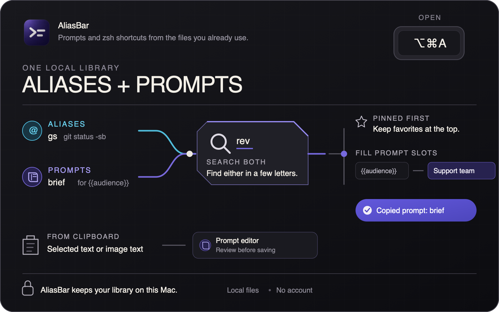

<picture>
  <source media="(prefers-color-scheme: dark)" srcset="docs/brand/title-dark.png">
  <source media="(prefers-color-scheme: light)" srcset="docs/brand/title.png">
  
</picture>

**Prompts and zsh shortcuts from the files you already use.**

AliasBar reads local Markdown prompts and the aliases and functions in `~/.zshrc`. Press `⌥⌘A`, search both, then copy or paste into the app you were using.


## Why AliasBar

Your aliases stay real zsh aliases. Your prompts stay plain Markdown. AliasBar adds one fast search without moving either into a closed snippet database. It needs no account and does not send your library to a hosted AI service.

## Features



- **Search both.** Prompts, aliases, and functions share one search. Pin frequent prompts and aliases. Press Tab to favor either library.
- **Fill the changing parts.** Add `{{project}}` to a prompt. AliasBar asks for each value and previews the finished text.
- **See what zsh will use.** Manage shows duplicate definitions, the winning line, and the file that contains it.
- **Edit aliases safely.** AliasBar edits its marked block, backs up the shell file, and validates zsh before saving.
- **Save from the clipboard.** Selected text opens in the prompt or alias editor. Selected image text opens in the prompt editor for review.
- **Build a library with review.** Copy a ready-made request into ChatGPT, Codex, or Claude Code. AliasBar validates each suggestion and waits for approval.

## See it work

[](docs/shortcut.mp4)

### Fill prompt slots

AliasBar asks for each `{{slot}}`, then shows the exact text it will copy or paste.


### Fix alias conflicts

Manage shows duplicate aliases, which definition wins, and where to fix it.


## Keys

| Key | Action |
|---|---|
| `⌥⌘A` | Open AliasBar |
| type | Search |
| `↑` `↓` | Move |
| `⏎` | Use the selected item |
| `⇥` | Favor prompts or aliases |
| `⌘K` | Open or close Clipboard |
| `⌘1` `⌘2` `⌘3` | Find, Board, Manage |
| `⌘P` | Pin or unpin an alias or prompt |
| `esc` | Close |

## Your files stay on your Mac


- Clipboard monitoring and disk history are off by default.
- Clipboard images stay in memory. AliasBar opens recognized text in the prompt editor for review.
- Pasting into another app requires Accessibility. Copying does not.
- AliasBar backs up your shell config before changing its own block.
- AliasBar uses the network only to check for and download updates. Automatic checks can be turned off.
- Syncing clipboard history is off by default. It writes clip text to your sync file, and that folder may sync through another service.
- Inline expansion pastes through the system clipboard. Your text sits there for about half a second, where other clipboard tools can read it.
- Local builds from `./build.sh` are signed with a local identity and turn off library validation, which Sparkle needs without an Apple Team ID. Official releases keep it on.

## Install

Requires macOS 13+ and Xcode Command Line Tools.

```sh
git clone https://github.com/localtoasted/aliasbar.git
cd aliasbar
./build.sh --install
open ~/Applications/AliasBar.app
```

Use another shell config with:

```sh
ALIASBAR_ZSHRC=~/.config/zsh/.zshrc open ~/Applications/AliasBar.app
```

## Command line

The build includes `.build/ab`:

```sh
.build/ab list
.build/ab search git
.build/ab add gs 'git status -sb'
```

## Build and test

```sh
./build.sh
./test.sh
```

`./test.sh` has three legs: the writer/core suite, the `ab` CLI integration checks, and the
SwiftPM test target. The third needs a full Xcode install — with Command Line Tools alone it
is skipped, and the skip is reported on stderr naming the suites that did not run.

Built with SwiftUI. MIT licensed.
